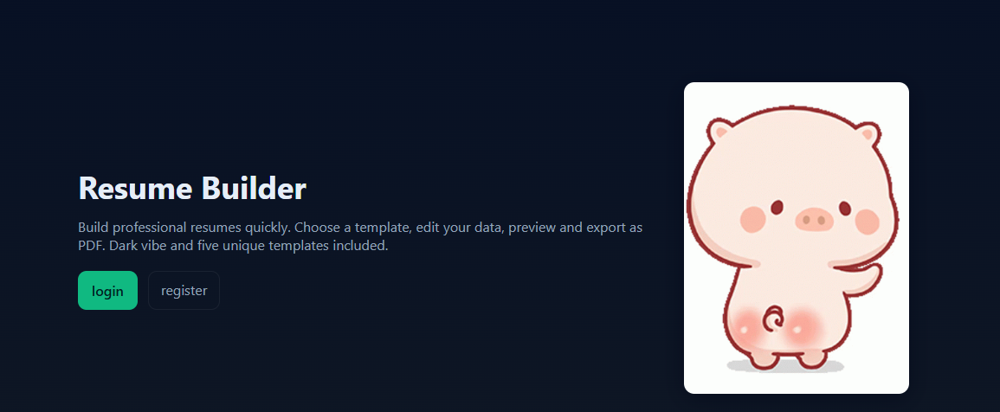
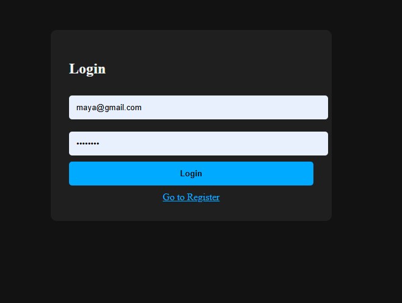
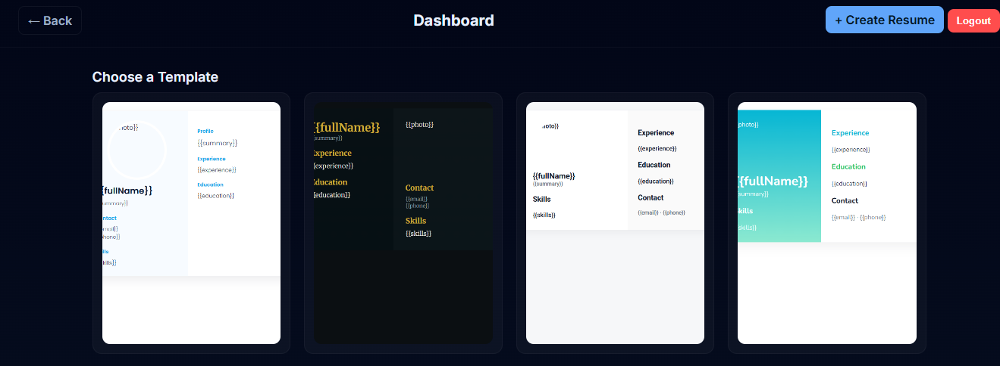
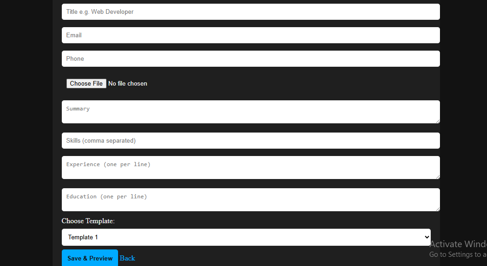
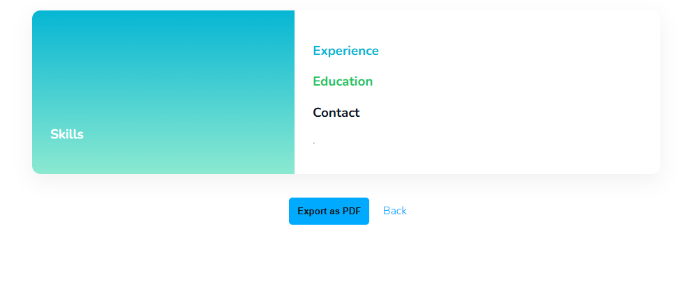
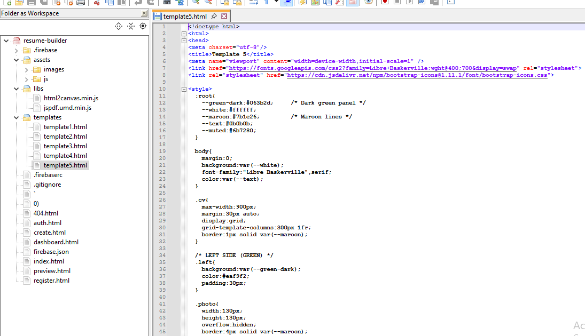

# 📄 Resume Builder – Modern Online CV Generator

---

## 🚀 Project Overview
**Resume Builder** is a modern and user-friendly web application that allows users to create, manage, preview, and download professional resumes.  
It offers multiple professional templates, Firebase authentication, and smooth navigation—from creating a resume to exporting it as a PDF.

**Purpose:**  
- Provide a simple and fast resume creation tool  
- Showcase front-end + Firebase development skills  
- Demonstrate form handling, template rendering, and PDF export  
- Create a polished portfolio-ready web application  

**Live Demo:** 👉 https://resume-builder-43545.web.app/

---

## 🌟 Portfolio-Ready Highlights
- **Firebase Authentication:** Secure login & register  
- **Resume CRUD:** Create, read, update, delete resumes  
- **5 Custom Templates:** Each with unique styling  
- **PDF Export:** html2canvas + jsPDF integration  
- **Dynamic Dashboard:** Lists saved resumes per user  
- **Preview Mode:** View resume before saving/downloading  
- **Responsive Design:** Works on all device sizes  
- **Clean UI Flow:** Home → Login → Dashboard → Create → Preview → Export  

---

## 📸 Screenshots / Sections Overview

| Section | Screenshot |
|--------|------------|
| Homepage |  |
| Login Page | |
| Dashboard |  |
| Create Resume Page |  |
| Resume Preview | |
| Template Page | |

> These screenshots guide the viewer through the entire resume creation process.

---

## 📁 Project Structure

resume-builder/
├── auth.html ← login page
├── register.html ← register page
├── index.html ← landing page (uses pig.gif)
├── dashboard.html ← user dashboard (avo.gif)
├── create.html ← resume input form
├── preview.html ← resume preview page (bir.gif)
│
├── templates/
│ ├── template1.html
│ ├── template2.html
│ ├── template3.html
│ ├── template4.html
│ └── template5.html
│
├── assets/
│ ├── js/
│ │ ├── main.js ← Firebase config + auth
│ │ ├── data.js ← save/read resume data
│ │ ├── template-loader.js ← injects data into templates
│ │ └── pdf.js ← export to PDF
│ │
│ └── images/
│ ├── pig.gif
│
└── libs/
├── jspdf.umd.min.js
└── html2canvas.min.js

---

## 🧭 Project Walkthrough

### **1. Landing Page (index.html)**
Simple welcome page featuring pig.gif and a "Get Started" button.

### **2. Login & Register**
Firebase Authentication handles all login and registration securely.

### **3. Dashboard (dashboard.html)**
Shows:
- All saved resumes  
- Buttons for *Create*, *Edit*, *Delete*, *Preview*  
- Smooth UI featuring avo.gif animation  

### **4. Create Resume (create.html)**
Users add:
- Personal details  
- Education  
- Work experience  
- Skills  
- Custom preferences  

### **5. Preview (preview.html)**
Displays a live preview with injected user data.  
Allows:
- Template selection  
- Saving  
- PDF export  
- bir.gif animation during loading  

### **6. Template System**
Each template is a standalone HTML layout with placeholders replaced by user data.

### **7. Export as PDF**
Uses:
- **html2canvas** → converts HTML to image  
- **jsPDF** → generates the final PDF file  

---

## 🧠 Skills & Technologies
- HTML5, CSS3, JavaScript  
- Firebase Authentication  
- Firestore / Realtime Database  
- jsPDF + html2canvas  
- Form Design & Validation  
- Template Rendering System  
- Local & Cloud Data Handling  
- Responsive UI Development  

---

## ⚡ Challenges & Solutions

### ✔ Challenge: Injecting data into 5 templates  
**Solution:**  
Created `template-loader.js` to map user data → template placeholders.

### ✔ Challenge: Managing multiple resumes  
**Solution:**  
Store each resume by unique user UID + resume ID in Firebase.

### ✔ Challenge: Clean PDF Export  
**Solution:**  
Optimized scaling & page size adjustments in pdf.js.

---

## 🔮 Future Improvements
- Add AI-powered resume suggestions  
- Add drag-and-drop layout editing  
- Add more templates and color themes  
- Allow multi-page resume export  
- Add dark & light mode  

---

## 🎉 Conclusion
The **Resume Builder Web App** is a complete solution for creating high-quality resumes online.  
With Firebase authentication, dynamic templates, and PDF exporting, it demonstrates strong practical skills in  
**front-end development, UI/UX design, and cloud-based data management**.

Perfect for portfolio showcasing and real-world use.

---
